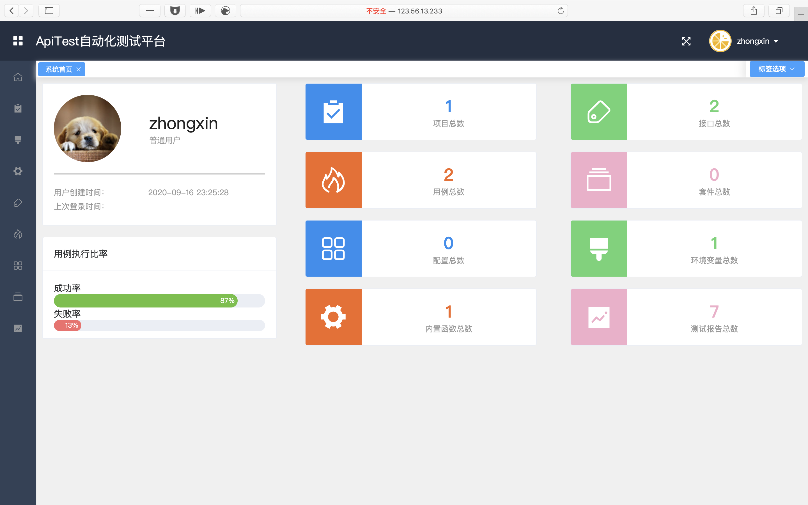
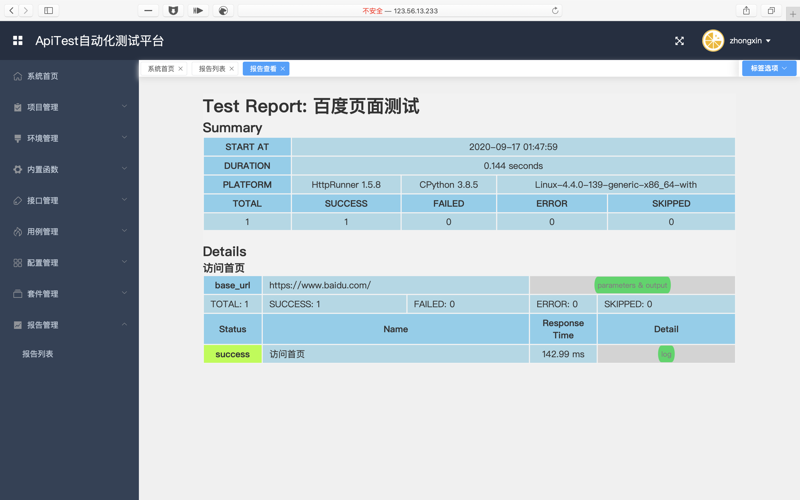

# 基于HttpRunner的接口测试平台
实例地址:[http://123.56.13.233:8866/](http://123.56.13.233:8866/)






## 部署方式
1. 修改部署的IP
> 全局搜索`123.56.13.233`,将该地址修改为需要部署的IP

2. 在项目根路径下运行
```shell
sh run.sh
```

## 使用方法

1. 在`项目管理`中进行`项目新增`
2. 在`环境管理`中进行`环境新增`
3. 在`接口管理`中进行`接口新增`
4. 在`用例管理`中进行`用例新增`
5. 在`项目管理`中运行测试
6. 在`报告管理`中查看执行结果

最小单位是`用例`,每个用例都可以单独执行进行测试

`接口`可以由多个用例组成

`项目`可以由多个`接口`组成

## 更新
前端有变更需要修改`/var/lib/docker/volumes/apitest_online_web/_data`中的文件

